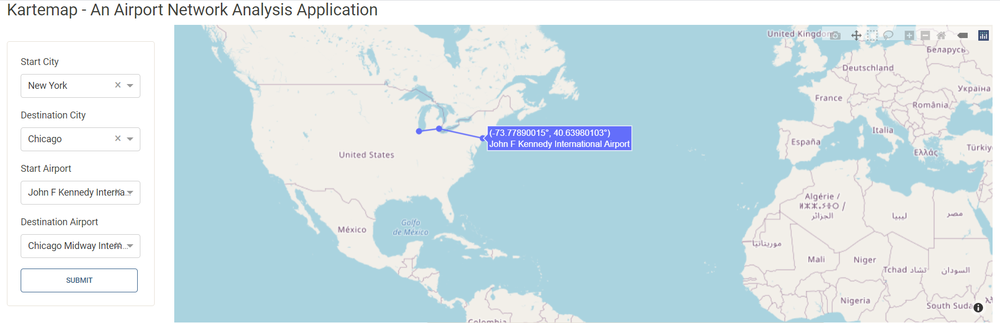

# Kartemap
This is the document for PythonII Assignment 1 - Kartemap Web Application

Specific input attributes are as follows:

1.List of city airport codes along with Longitude\Latitude, population, and image for each city.  Start with only 5-10 cities to make the application work and then scale to all cities.

2.Model analytics to compute distances from city long\lat coordinates.

3.Using the Network Analysis code that I provided to compute the least cost path between a start and end node.

4.Dash Layout - Design and build your screen with Dash GUI components.

5.Dash Callbacks - Design and build user interaction with Dash callbacks.

6.Deploy your application onto your local computer.

The final output:

Screenshot1:

Screenshot2:

